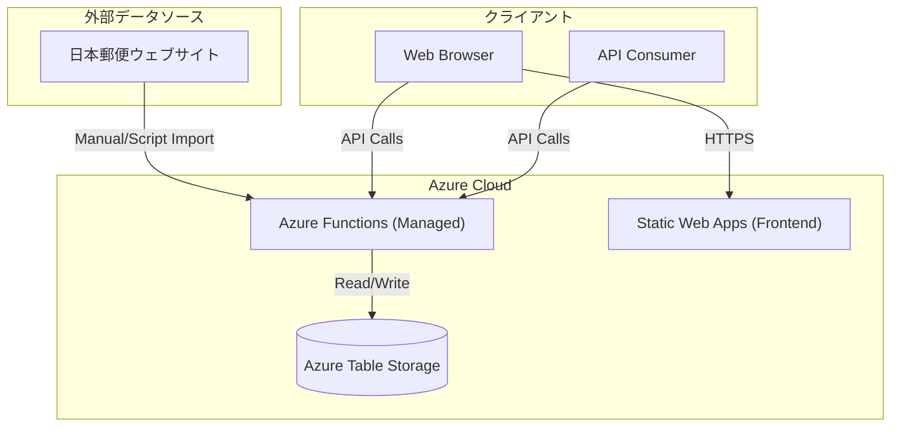

# 郵便番号API システム実装計画書

日本郵便が提供する郵便番号データを活用し、Azure Functions + Table Storageで構築されたサーバーレスAPIおよびReactフロントエンドを提供するシステム。

---

## 調査結果サマリー

### データソース

| データ種別 | URL | エンコーディング | 更新頻度 |
|-----------|-----|-----------------|---------|
| 住所郵便番号（UTF-8形式） | [utf_ken_all.zip](https://www.post.japanpost.jp/zipcode/dl/utf/zip/utf_ken_all.zip) | UTF-8 | 月次（月末） |
| 事業所郵便番号 | [jigyosyo.zip](https://www.post.japanpost.jp/zipcode/dl/jigyosyo/zip/jigyosyo.zip) | Shift-JIS | 月次 |

---

## 技術スタック（実装済み）

- **言語**: TypeScript (Node.js 20+)
- **バックエンド**: Azure Functions (v4 Programming Model)
- **データベース**: Azure Table Storage (NoSQL)
- **フロントエンド**: React (Vite) + Tailwind CSS + Lucide React
- **デプロイ**: Azure Static Web Apps
- **インフラ**: Managed Functions (Production)

---

## システムアーキテクチャ



---

## 実装済み機能 (Completed Features)

### 1. 郵便番号検索API
- `/api/postal-codes/{code}`: 郵便番号から住所を取得
- `/api/postal-codes/search?q=...`: 住所または郵便番号の一部から検索
- **特徴**:
    - 複数キーワード対応（スペース区切りでAND検索）
    - 連結住所対応（例：「町田市小山町」）
    - ローマ字検索対応（Issue #6: "shinjuku" -> "新宿"）
    - 厳格なリミット検証（Issue #4）

### 2. データ管理
- `import_to_table.py`: Pythonスクリプトによるデータインポート
    - 郵便番号データのパースとTable Storageへのバッチ登録
    - `System` テーブルへの最終更新日時の記録

### 3. フロントエンド (Web UI)
- **モダンなUI**: Glassmorphismデザイン、ダークモード対応
- **機能**:
    - 住所・郵便番号の切り替え検索
    - クリップボードコピー機能
    - 英語対応（Localization: Issue #5）
    - APIドキュメントページ

### 4. その他機能
- **Nostalgic Counter**: 訪問者カウンター機能 (`/api/counter`)
- **Stats API**: 更新日時を含む統計情報 (`/api/stats`)
- **独自ドメイン**: `postcodejp.ddns.net` での運用

---

## プロジェクト構成

```
postcodejp/
├── azure-functions/      # バックエンド (Azure Functions)
│   ├── src/
│   │   └── functions/
│   │       └── api.ts    # APIロジック集約
│   ├── package.json
│   └── host.json
├── frontend/             # フロントエンド (React)
│   ├── src/
│   │   ├── components/
│   │   ├── contexts/     # 言語コンテキスト等
│   │   └── api/          # APIクライアント
│   └── package.json
├── tools/                # データインポート用スクリプト
│   └── import_to_table.py
├── docs/                 # ドキュメント
└── Taskfile.yml          # タスクランナー定義
```

---

## API仕様

### Endpoints

| Method | Path | 説明 |
|--------|------|------|
| GET | `/api/postal-codes/{postal_code}` | 郵便番号から住所を取得 (7桁) |
| GET | `/api/postal-codes/search` | 住所、読み仮名、ローマ字で検索 |
| GET | `/api/prefectures` | 都道府県一覧 |
| GET | `/api/offices/{postal_code}` | 事業所個別郵便番号検索 |
| GET | `/api/stats` | システム統計（データ更新日時など） |
| GET | `/api/counter` | 訪問者カウンター |

### Query Parameters (Search)

- `q`: 検索キーワード（必須）
- `limit`: 取得件数（任意、デフォルト20、最大100）

---

## 今後の拡張予定

1. **データ自動更新**: GitHub ActionsまたはAzure Functions Timer Triggerによる定期更新
2. **キャッシュ層**: 必要に応じたCDNやRedisの導入（現在はTable Storageの高速性に依存）
3. **履歴データ**: 廃止データのアーカイブ化
