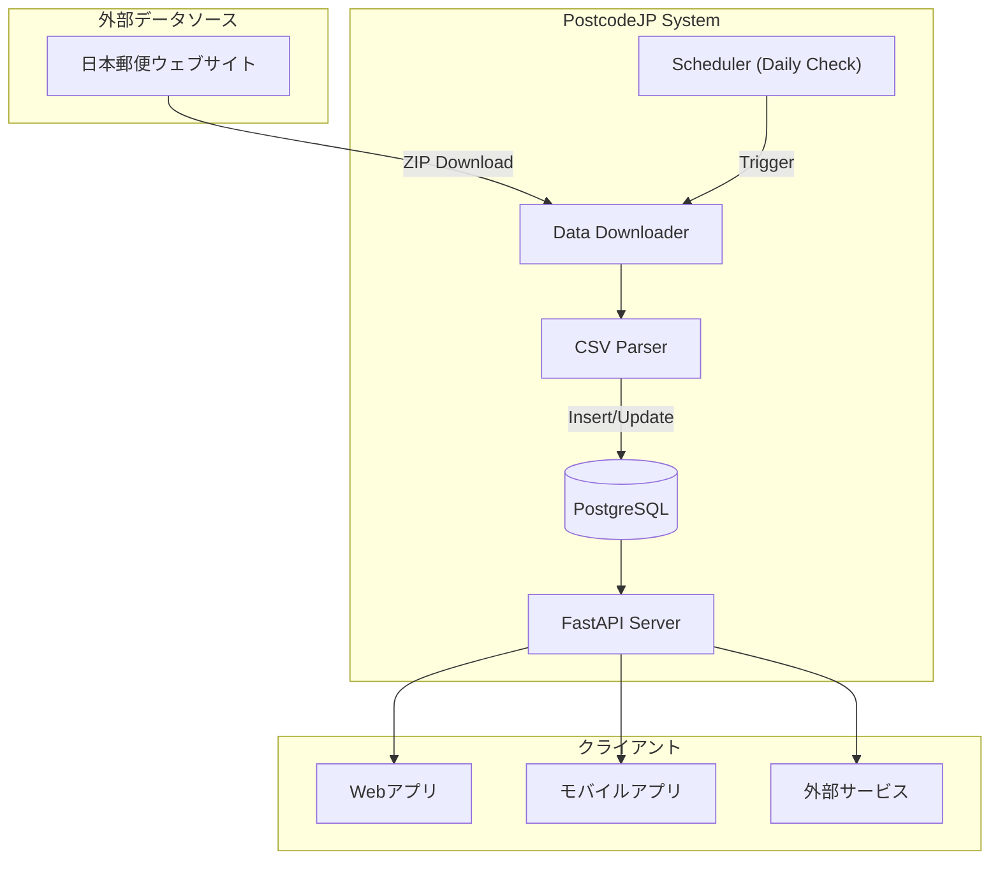

# 郵便番号API システム実装計画書

日本郵便が提供する郵便番号データを活用し、データベースに格納して検索APIを提供するシステムを構築する。毎日更新を確認し、差分データにより効率的にデータを最新状態に保つ。

---

## 調査結果サマリー

### データソース

| データ種別 | URL | エンコーディング | 更新頻度 |
|-----------|-----|-----------------|---------|
| 住所郵便番号（UTF-8形式） | [utf_ken_all.zip](https://www.post.japanpost.jp/zipcode/dl/utf/zip/utf_ken_all.zip) | UTF-8 | 月次（月末） |
| 住所差分新規 | utf_add_YYMM.zip | UTF-8 | 月次 |
| 住所差分廃止 | utf_del_YYMM.zip | UTF-8 | 月次 |
| 事業所郵便番号 | [jigyosyo.zip](https://www.post.japanpost.jp/zipcode/dl/jigyosyo/zip/jigyosyo.zip) | Shift-JIS | 月次 |

### 住所郵便番号CSVフィールド（15項目、UTF-8版）

| # | フィールド名 | 型 | 説明 |
|---|-------------|---|------|
| 1 | local_gov_code | VARCHAR(5) | 全国地方公共団体コード |
| 2 | old_postal_code | VARCHAR(5) | 旧郵便番号（5桁） |
| 3 | postal_code | VARCHAR(7) | 郵便番号（7桁） |
| 4 | prefecture_kana | TEXT | 都道府県名（カタカナ） |
| 5 | city_kana | TEXT | 市区町村名（カタカナ） |
| 6 | town_kana | TEXT | 町域名（カタカナ） |
| 7 | prefecture | TEXT | 都道府県名（漢字） |
| 8 | city | TEXT | 市区町村名（漢字） |
| 9 | town | TEXT | 町域名（漢字） |
| 10 | multi_postal_flag | INT | 複数郵便番号フラグ |
| 11 | koaza_banchi_flag | INT | 小字番地起番フラグ |
| 12 | chome_flag | INT | 丁目フラグ |
| 13 | multi_town_flag | INT | 複数町域フラグ |
| 14 | update_flag | INT | 更新表示（0:変更なし、1:変更あり、2:廃止） |
| 15 | change_reason | INT | 変更理由（0〜6） |

### 事業所郵便番号CSVフィールド（13項目）

| # | フィールド名 | 型 | 説明 |
|---|-------------|---|------|
| 1 | local_gov_code | VARCHAR(5) | 全国地方公共団体コード |
| 2 | office_kana | TEXT | 事業所名（カナ） |
| 3 | office_name | TEXT | 事業所名（漢字） |
| 4 | prefecture | TEXT | 都道府県名 |
| 5 | city | TEXT | 市区町村名 |
| 6 | town | TEXT | 町域名 |
| 7 | address_detail | TEXT | 番地等 |
| 8 | postal_code | VARCHAR(7) | 郵便番号 |
| 9 | old_postal_code | VARCHAR(5) | 旧郵便番号 |
| 10 | post_office | TEXT | 取扱郵便局 |
| 11 | type | INT | 種別（0:大口、1:私書箱） |
| 12 | multi_number | INT | 複数番号（0:なし、1:あり） |
| 13 | change_reason | INT | 修正コード |

---

## User Review Required

> [!IMPORTANT]
> ### 技術スタック確認
> 以下の技術スタックを想定していますが、ご要望があれば変更可能です。
> - **言語**: Python 3.11+
> - **フレームワーク**: FastAPI
> - **データベース**: PostgreSQL
> - **スケジューラ**: APScheduler（軽量）またはCelery + Redis（本格運用）

> [!WARNING]
> ### データ更新方式
> 日本郵便はAPIを提供していないため、**ファイルのダウンロード日時やサイズをチェック**して更新有無を判定します。完全な差分検知は困難なため、月次で全データを再取得・照合する運用を推奨します。

---

## システムアーキテクチャ



---

## Proposed Changes

### Component: Database Schema

#### [NEW] [schema.sql](file:///Users/ytada/projects/postcodejp/database/schema.sql)
データベーススキーマ定義。以下のテーブルを作成：
- `postal_codes`: 住所郵便番号マスタ
- `office_postal_codes`: 事業所郵便番号マスタ  
- `prefectures`: 都道府県マスタ（検索最適化用）
- `cities`: 市区町村マスタ（検索最適化用）
- `sync_history`: 同期履歴管理

---

### Component: Data Importer

#### [NEW] [app/services/downloader.py](file:///Users/ytada/projects/postcodejp/app/services/downloader.py)
日本郵便からのZIPファイルダウンロード機能：
- HTTP HEADリクエストでLast-Modified取得
- 変更があればダウンロード
- ZIP解凍・CSVファイル取得

#### [NEW] [app/services/parser.py](file:///Users/ytada/projects/postcodejp/app/services/parser.py)
CSVパース・データ変換機能：
- UTF-8形式住所データのパース
- Shift-JIS形式事業所データのパース
- データベースモデルへの変換

#### [NEW] [app/services/importer.py](file:///Users/ytada/projects/postcodejp/app/services/importer.py)
データインポート機能：
- 初回フルインポート
- 差分更新（add/delファイル対応）
- トランザクション管理

#### [NEW] [app/services/scheduler.py](file:///Users/ytada/projects/postcodejp/app/services/scheduler.py)
日次更新スケジューラ：
- 毎日指定時刻に更新チェック実行
- 更新検知時は差分データ取得・適用

---

### Component: API Server

#### [NEW] [app/main.py](file:///Users/ytada/projects/postcodejp/app/main.py)
FastAPIアプリケーションエントリーポイント

#### [NEW] [app/routers/postal_codes.py](file:///Users/ytada/projects/postcodejp/app/routers/postal_codes.py)
郵便番号関連APIエンドポイント：

| Method | Path | 説明 |
|--------|------|------|
| GET | `/api/postal-codes/{postal_code}` | 郵便番号から住所を取得 |
| GET | `/api/postal-codes/search` | 住所文字列で郵便番号を検索 |
| GET | `/api/prefectures` | 都道府県一覧 |
| GET | `/api/prefectures/{code}/cities` | 市区町村一覧 |
| GET | `/api/cities/{code}/towns` | 町域一覧 |

#### [NEW] [app/routers/offices.py](file:///Users/ytada/projects/postcodejp/app/routers/offices.py)
事業所郵便番号関連APIエンドポイント：

| Method | Path | 説明 |
|--------|------|------|
| GET | `/api/offices/{postal_code}` | 郵便番号から事業所情報を取得 |
| GET | `/api/offices/search` | 事業所名で検索 |

#### [NEW] [app/routers/admin.py](file:///Users/ytada/projects/postcodejp/app/routers/admin.py)
管理用APIエンドポイント：

| Method | Path | 説明 |
|--------|------|------|
| POST | `/api/admin/sync` | 手動同期実行 |
| GET | `/api/admin/sync/status` | 同期ステータス取得 |
| GET | `/api/admin/sync/history` | 同期履歴取得 |

---

### Component: Models & Schemas

#### [NEW] [app/models/postal_code.py](file:///Users/ytada/projects/postcodejp/app/models/postal_code.py)
SQLAlchemy ORMモデル定義

#### [NEW] [app/schemas/postal_code.py](file:///Users/ytada/projects/postcodejp/app/schemas/postal_code.py)
Pydantic APIスキーマ定義

---

### Component: Configuration

#### [NEW] [app/config.py](file:///Users/ytada/projects/postcodejp/app/config.py)
アプリケーション設定（環境変数から読み込み）

#### [NEW] [.env.example](file:///Users/ytada/projects/postcodejp/.env.example)
環境変数テンプレート

#### [NEW] [requirements.txt](file:///Users/ytada/projects/postcodejp/requirements.txt)
Python依存パッケージ

#### [NEW] [docker-compose.yml](file:///Users/ytada/projects/postcodejp/docker-compose.yml)
PostgreSQL + アプリケーション用Docker Compose設定

---

## プロジェクト構成

```
postcodejp/
├── app/
│   ├── __init__.py
│   ├── main.py               # FastAPIエントリーポイント
│   ├── config.py             # 設定管理
│   ├── database.py           # DB接続
│   ├── models/
│   │   ├── __init__.py
│   │   └── postal_code.py    # ORMモデル
│   ├── schemas/
│   │   ├── __init__.py
│   │   └── postal_code.py    # APIスキーマ
│   ├── routers/
│   │   ├── __init__.py
│   │   ├── postal_codes.py   # 郵便番号API
│   │   ├── offices.py        # 事業所API
│   │   └── admin.py          # 管理API
│   └── services/
│       ├── __init__.py
│       ├── downloader.py     # データダウンロード
│       ├── parser.py         # CSVパース
│       ├── importer.py       # データインポート
│       └── scheduler.py      # スケジューラ
├── database/
│   └── schema.sql            # スキーマ定義
├── tests/
│   ├── __init__.py
│   ├── test_parser.py        # パーサーテスト
│   ├── test_api.py           # APIテスト
│   └── conftest.py           # pytest設定
├── scripts/
│   └── init_data.py          # 初期データ投入スクリプト
├── docker-compose.yml
├── requirements.txt
├── .env.example
└── README.md
```

---

## Verification Plan

### Automated Tests

#### 1. ユニットテスト（pytest）
```bash
# 全テスト実行
cd /Users/ytada/projects/postcodejp
pytest tests/ -v

# カバレッジ付き
pytest tests/ --cov=app --cov-report=html
```

#### 2. APIテスト（pytest + httpx）
```bash
# APIエンドポイントテスト
pytest tests/test_api.py -v
```

#### 3. CSVパーサーテスト
```bash
# パーサーのユニットテスト
pytest tests/test_parser.py -v
```

### Manual Verification

#### 1. 初期データインポート確認
1. Docker Composeでシステム起動：`docker-compose up -d`
2. 初期データ投入スクリプト実行：`python scripts/init_data.py`
3. PostgreSQLに接続してデータ件数確認：
   - `SELECT COUNT(*) FROM postal_codes;` → 約12万件
   - `SELECT COUNT(*) FROM office_postal_codes;` → 約2万件

#### 2. API動作確認（ブラウザまたはcurl）
```bash
# 郵便番号検索
curl http://localhost:8000/api/postal-codes/1000001

# 住所から検索
curl "http://localhost:8000/api/postal-codes/search?q=千代田区"

# 都道府県一覧
curl http://localhost:8000/api/prefectures
```

#### 3. Swagger UIでの確認
- http://localhost:8000/docs にアクセスし、全エンドポイントを対話的にテスト

### Performance Benchmarks

#### 1. 郵便番号検索（直接検索）
- 目標: < 50ms
- テスト: `ab -n 1000 -c 10 http://localhost:8000/api/postal-codes/1000001`

#### 2. 住所フリーワード検索
- 目標: < 200ms
- テスト: `ab -n 100 -c 5 "http://localhost:8000/api/postal-codes/search?q=渋谷"`

---

## 今後の拡張可能性

1. **ローマ字対応**: roman_zipデータも取り込み、ローマ字検索に対応
2. **履歴管理**: 廃止データを保持し、過去の郵便番号も検索可能に
3. **キャッシュ導入**: Redis導入により応答速度向上
4. **全文検索**: PostgreSQL FTS または Elasticsearchで高度な検索
